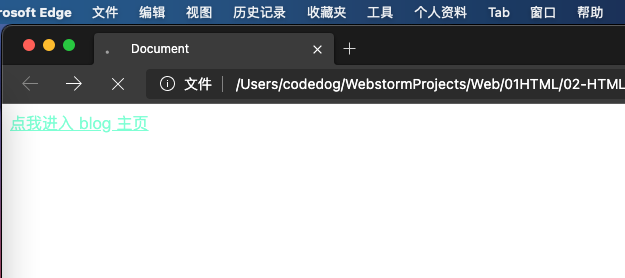
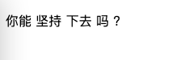

## 编辑器相关

前端开发的编辑器软件, 我首先推荐 VS Code, 其次推荐 Sublime Text.

(个人使用WebStorm, 因为之前写 Java 一直使用的是 IDEA 所以比较喜欢他们家公司的IDE, 以后应该会投往 VS Code 的怀抱, 没用过 Intellij 家产品的, 建议直接 VS Code)

PS: 文件的后缀名不能决定文件格式, 只能决定打开文件的方式

### HTML 的概念

**HTML** 全称为 HyperText Markup Language, 译为 <font color=#000ff>**超文本标记语言**</font>.

HTML 不是一种编程语言, 是一种描述性的**标记语言**.

**作用**: HTML 是负责描述文档**语义**的语言.

### 概念: 超文本

所谓的超文本, 有两层含义:

（1）图片、音频、视频、动画、多媒体等内容, 成为超文本, 因为它们超出了文本的限制.

（2）不仅如此, 它还可以从一个文件跳转到另一个文件, 与世界各地主机的文件进行连接. 即: 超级链接文本.

### 概念: 标记语言

HTML 不是一种变成语言, 是一种描述性的**标记语言**. 这主要有两层含义:

（1）**标记语言是一套标记标签**. 比如 `<a>` 表示超链接、标签 `` 表示图片、 标签 `<h1>` 表示一级标题等等, 它们都是属于 HTML 标签.

说得通俗一点就是: 网页是由网页元素组成的, 这些元素是由 HTML 标签描述出来, 然后通过浏览器解析, 就可以显示给用户看了.

（2）编程语言是有编译过程的, 而标记语言没有编译过程, HTML 标签是由浏览器直接解析执行.

### HTML 是负责描述文档语义的语言

HTML 格式的文件是一个纯文本文件 (就是用txt文件改名而成) , 用一些标签来描述语义, 这些标签在浏览器页面上是无法直观看到的, 所以称之为 "超文本标记语言".

接下来, 我们需要学习 HTML 中的很多 "标签对儿" 能够给文本不同的语义.

比如, 面试的时候问你, `<h1>` 标签有什么作用?

- 正确回答: 给文本增加主标题的语义.
- 错误回答: 给文本加粗、加黑、变大.

关乎 "语义" 的更加深刻理解, 等接下来我们学习了各种标签, 就明白了.

## HTML 的历史


其中, 我们专门来对 XHTML 做一个介绍.

**XHTML介绍: **
XHTML: Extensible Hypertext Markup Language, 可扩展超文本标记语言.
XHTML 的主要目的不是为了<font color="blue">**取代HTML**</font>, 也可以理解为 HTML 的升级版.
XHTML 的标记书写很不规范, 会造成其他的设备 (ipad、手机、电视等) 无法正常显示.
XHTML 与 HTML4.0 的标记基本上一样.
XHTML 是<font color="blue">**严格的、纯净的**</font> HTML.

我们稍后将对 XHTML 的便携规范进行介绍.

## HTML 的专有名词

- 网页: 由各种标记组成的一个页面就叫网页.
- 主页 (首页): 一个网站的起始页面或者导航页面.
- 标记: 比如 `<p>` 称为开始标记, `</p>` 称为结束标记, 也叫标签. 每个标签都规定好了特殊的含义.
- 元素: 比如 `<p>内容</p>` 称为元素.
- 属性: 给每一个标签所做的辅助信息.
- XHTML: 符合 XML 语法标准的 HTML
- DHTML: dynamic, 动态的. `JavaScript + CSS + HTML` 合起来的页面就是一个 DHTML.
- HTTP: 超文本传输协议. 用来规定客户端浏览器和服务器交互时数据的一个格式. SMTP: 邮件传输协议, FTP: 文件传输协议.

## 书写第一个 HTML 页面

我们打开编辑器, 新建一个文件, 名叫 `test.html` (注意, 文件名是 `test`, 后缀名是 `.html`), 保存到本地.

紧接着, 在文件里输入, `html`, 然后按一下键盘上的 `Tab` 键, 就可以自动生成如下内容

```html
<!doctype html>
<html lang="en">
<head>
    <meta charset="UTF-8">
    <meta name="viewport"
          content="width=device-width, user-scalable=no, initial-scale=1.0, maximum-scale=1.0, minimum-scale=1.0">
    <meta http-equiv="X-UA-Compatible" content="ie=edge">
    <title>Document</title>
</head>
<body>

</body>
</html>
```

上面的内容, 就是 HTML 页面的骨架. 我们在此基础智商, 新增几个标签, 完整代码如下:

```html
<!doctype html>
<html lang="en">
<head>
    <meta charset="UTF-8">
    <meta name="viewport"
          content="width=device-width, user-scalable=no, initial-scale=1.0, maximum-scale=1.0, minimum-scale=1.0">
    <meta http-equiv="X-UA-Compatible" content="ie=edge">
    <title>Document</title>
</head>
<body>
    <h3>我是三级标题</h3>
    
    <a href="http://wangyongsi.top">我是一个超链接, 可以点击一下</a>
</body>
</html>
```
标签写完后, 我们用 Chrome 浏览器打开上面这个 `test.html` 文件, 看看页面效果:

到此, 第一个简单的 HTML 页面就写完了. 是不是很有成就感?

## HTML 结构详解

HTML 标签通常是成对出现的 (<font color="blue">**双边标记**</font>), 比如 `<div>` 和 `</div>`; 也有少部分单标签 (<font color="blue">单边标记</font>), 如 `<br />` 、`<hr />` 和 `` 等.

属性与标记之间、各属性之间需要以空格隔开. 属性值以双引号括起来.

#### HTML 骨架标签分类

| 标签名 | 定义 | 说明 |
| -----------| :--------: | :-----------------------------|
| `<html></html>`   | HTML 标签 | 页面中最大的标签, 我们称为根标签|
| `<head></head>`   | 文档的头部 | 注意在 head 标签中, 我们必须要设置的标签是 title     |
| `<title></title>` | 文档的标题 | 让页面拥有一个属于自己的网页标题 |
| `<body></body>`   | 文档的主体 | 元素包含文档的所有内容, 页面内容基本都放到 body 里面的 |

### 快速生成 HTML 的骨架

在 WebStorm 中新建 HTML 文件, 输入 `!`, 按 `Tab` 键后, 自动生成骨架.

### 1、文档声明头

任何一个标准的 HTML 页面, 第一行一定是以 `<!DOCTYPE ......>` 开头的语句. 这一行, 就是文档声明头, 即 DocType Declaration, 简称 DTD.

**DTD 可告知浏览器文档使用那种 HTML 或 XHTML 规范**.

#### HTML4.0 有哪些规范呢?

**HTML4.01** 这个版本是 IE6 开始兼容的. **HTML5 是 IE9 开始兼容的**. 如今, 手机、移动端的网页, 也可以使用 HTML5 了, 因为其兼容性更高.

说个题外话, HTML1 至 HTML3 是美国军方以及高等研究所用的, 并未对外公布.

HTML4.01 里面有两大种规范, 每大种规范里面又各有三种小规范. 所以一共六种规范.

HTML4.01 立main规定了**普通** 和 **XHTML** 两大种规范. HTML 觉得自己有一些规定不严谨, 比如, 标签是否可以用大写字母呢? `<H1></H1>` 所以, HTML就觉得, 应该制定一些严格的规范, 所以又制定了 XHTML1.0 . 在 XHTML 中的字母 X , 表示 "严格的".

总结一下, HTML4.01 一共有六种 DTD . 说白了, HTML 的第一行语句一共有 6 种情况:


下面对上图种的三种小规范进行解释:

**strict**

表示 "严格的", 这种模式里面的要求更为严格, 这种严格体现在哪里? 有一些标签不能使用.

比如, u 标签, 就是给一个文本加下划线, 但是这和 HTML 的本质有冲突, 因为 HTML 最好只负责语义, 不要负责样式, 而 u 这个下划线是样式. 所以, 在 strict 中是不能使用 u 标签的.

那怎么给文本增加下划线呢? 今后将使用 CSS 属性来解决.

XHTML1.0 更为严格, 因为这个体系本身规定, 比如标签必须是小写字母, 必须严格闭合标签, 必须使用引号把属性引起来等等.

**Transitional**: 表示 "普通的", 这种模式就是没有一些别的规范.

**Frameset**: 表示 "框架", 在框架页面中使用.

在 sublime 输入的 html:xt, x 表示XHTML, t 表示 transitional.

在 HTML5 中极大的简化了 DTD, 也就是说 HTML5 中就没有 XHTML 了. HTML5 的 DTD (文档声明头) 如下:

```html
<!DOCTYPE html>
```

### 2、页面语言 `lang`

```html
<html lang="en">
```

最常见的语言类型有两种:

- en: 定义页面语言为英语.

- zh-CN: 定义页面语言为中文

### 2、头标签 `head`

#### HTML5 的比较完整的骨架:

```html
<!doctype html>
<html lang="en">
<head>
    <meta charset="UTF-8">
    <meta name="viewport"
          content="width=device-width, user-scalable=no, initial-scale=1.0, maximum-scale=1.0, minimum-scale=1.0">
    <meta http-equiv="X-UA-Compatible" content="ie=edge">
    <meta name="Author" content="codeDog999">
    <meta name="Keywords" content="努力,就会成功">
    <meta name="Description" content="网易是中国领先的互联网技术公司，为用户提供免费邮箱、游戏、搜索引擎服务，开设新闻、娱乐、体育等30多个内容频道，及博客、视频、论坛等互动交流，网聚人的力量。" />
    <title>Document</title>
</head>
<body>

</body>
</html>
```

面试题:

- 问: 网页的 head 标签里面, 表示的是页面的配置, 有什么配置?
- 答: 字符集、关键词、页面描述、页面标题、IE 适配、视口、iPhone 小图标等.

头标签内部的常见标签如下:

- `<title>`: 指定整个网页的标题, 在浏览器最上方显示.
- `<base>`: 为页面上的所有链接规定默认地址或默认目标.
- `<meta>`: 提供关于页面的基本信息.
- `<body>`: 用于定义 HTML 文档所要显示的内容, 也称为主体标签. 我们所写的代码必须放在此标签内.
- `<link>`: 定义文档外部资源的关系.

**meta 表示 "元" . "元" 配置, 就是表示基本的项目配置. **

常见的集中 meta 标签如下:

（1）字符集 charset:

```html
<meta charset="UTF-8">
```

字符集用 meta 标间中的 `charset` 定义, charset 就是 character set (即 "字符集设置" ), 即**网页的编码方式**.

**字符集** (Character set) 是多个字符的集合. 计算机要准确的处理各种字符集文字, 需要进行字符编码, 以便计算机能够识别和存储各种文字.

上面这行代码非常关键, 是必须要写的代码, 否则可能导致**乱码**. 比如你保存的时候, meta 写的和声明的不匹配, 那么浏览器就是乱码.

utf-8 是目前最常用的字符集编码方式, 常用的字符集编码方式还有 gbk 和 gb2312 等. 关于 "编码方式", 我们在下一段会详细介绍.

（2）视口 viewport:

```html
    <meta name="viewport" content="width=device-width, initial-scale=1.0">
```

viewport 这个知识点, 初学者还是比较难理解, 以后学 Web 移动端的时候会用到. 所以, 到时候再说.

（3）定义 "关键字":

举例如下:

```html
    <meta name="Keywords" content="网易,邮箱,游戏,新闻,体育,娱乐,女性,亚运,论坛,短信" />
```

这些关键词, 就是告诉搜索引擎, 这个网页是干嘛的, 能够提高搜索命中率. 让别人能够找到你的网页, 搜索到你的网页.

（4）定义 "页面描述"：

meta 除了可以设置字符集, 还可以设置关键字和页面描述.

只要设置 Description 页面描述, 那么百度搜索结果, 就能够显示这些语句, 这个技术叫做**SEO** (search engine optimization, 搜索引擎优化).

设置页面描述的举例:

```html
    <meta name="Description" content="网易是中国领先的互联网技术公司，为用户提供免费邮箱、游戏、搜索引擎服务，开设新闻、娱乐、体育等30多个内容频道，及博客、视频、论坛等互动交流，网聚人的力量。" />
```

效果如下:


上面的几种 `<meta>` 标签都不用记, 但是另外还有一个 `<meta>` 标签是需要记住的:

```html
<meta http-equiv="refresh" content="3;http://wangyongsi.top">
```

上面这个标签的意思是说, 3秒之后, 自动跳转到后面的网址.

**title 标签**

用于设置网页标题:

```html
    <title>网页标题</title>
```

title 标签也是有助于SEO搜索引擎优化的.

**base 标签**

```html
<base href="">
```

base 标签用于制定基础的路径, 指定之后, 所有的 a 链接都是以这个路径为基准.

### 3、 `<body>` 标签

`<body>` 标签的属性有:

- `bgcolor`: 这是网页整个的背景颜色.
- `background`: 设置整个网页的背景图片.
- `text`: 设置网页中的文字颜色.
- `leftmargin`: 网页的左边距, IE浏览器默认是 8 个像素.
- `topmargin`: 网页的上边距.
- `rightmargin`: 网页的右边距.
- `bottommargin`: 网页的下边距.

`<body>` 标签还有另外一些属性, 这里用个例子来解释:

```html
<body link="#00bfff" alink="#ffc0cb" vlink="#7fffd4">
    <a href="http://wangyongsi.top">点我进入 blog 主页</a>
</body>
```
上方代码中, 当我们对 `点我进入 blog 主页` 这几个子使用超链接时, `link` 属性表示默认显示的颜色, `alink` 属性表示鼠标点击但是没有松开的颜色, `vlink` 属性表示点击完成之后显示的颜色, 效果如下:



## 计算机编码介绍

计算机, 不能直接存储文字, 存储的是编码.

计算机只能处理二进制的数据, 其他数据, 比如: 0-9、 a-z、A-Z, 这些字符, 我们可以定义一套规则来表示. 假如: A 用 110 表示, B 用 111 表示等.

**ASCII码: **

美国发布的, 用1个字节 (8位二进制) 来表示一个字符, 共可以表示 2^8=256 个字符.
    
    美国的国家语言是英语, 只能表示 0-9、 a-z、A-Z、特殊符号.

**ANSI编码: **
**每个国家为了显示本国的语言, 都对ASCII码进行了扩展**. 用2个字节(16位二进制) 来表示一个汉字, 共可以表示 2^16=65536 个汉字. 例如:
中国的 ANSI 编码是 GB2312 编码(简体), 对 6763 汉字进行编码, 含 600 多个特殊字符. 另外还有 GBK (简体).
日本的 ANSI 编码是 JIS 编码.
台湾的 ANSI 编码是 BIG5 编码 (繁体).

**GBK: **

对 GB2312 进行了扩展, 用来显示罕见的、古汉语的汉字. 现在已经收录了 2.1 万左右. 并提供了 1890 个汉字码位. K的含义就是 "扩展".

**Unicode编码 (统一编码): **

用 4 个字节 (32位二进制) 来表示一个字符, 想法不错, 但是效率太低. 例如, 字母 A 用 ASCII 表示的话, 一个字节就够了, 可是用 Unicode 编码的话, 得用 4 个字节表示, 造成了空间的极大浪费. A的Unicode编码是0000 0000 0000 0000 0000 0000 0100 0000

**UTF-8 (Unicode Transform Format) 编码: **

根据字符的不同, 选择器编码长度. 比如: 一个字符 A 用一个字节表示, 一个汉字用 2 个字节表示.

毫无疑问, 开发中, 都用 **UTF-8** 编码吧, 准没错.

**中文能够使用的字符集:**

- 第一种: UTF-8. UTF-8 是国际通用字库, 里面涵盖了所有地球上所有人类的语言文字, 比如阿拉伯文、汉语、鸟语......

- 第二种: GBK (对 GB2312 进行了扩展). GB2312 是国标, 是中国的字库, 里面 **仅** 涵盖了汉字和一些常用的外文, 比如日文片假名, 和常见的符号.

字库规模: UTF-8 (字很全) > GB2312 (只有汉字)

**重点1: 避免乱码**

我们用 meta 标签声明当前的这个 HTML 文档的字库, 一定要和保存的文件的编码类型一样, 否则乱码 (重点).

**重点2: UTF-8 和 GB2312 的比较**

保存大小: UTF-8 (更臃肿、加载更慢) > GB2312 (更小巧、加载更快)

总结:
- UTF-8: 字多, 有各种国家的语言, 但是保存尺寸大, 文件臃肿.
- GB2312: 字少, 只用中文和少数外语符号, 但是尺寸小, 文件小巧.

列出 2 个使用情形:
- qq、网易、搜狐都是使用 gb2312 . 这些公司, 都追求显示速度.
- 新华网藏语频道, 使用的是 UTF-8, 保证字符集的数量.

我们是怎么查看网页的编码方式呢? 在浏览器中打开网页, 右键, 选择 "查看网页源代码" , 找到 meta 标签中的 charset 属性即可.

那么, 我们为什么可以查看网页的源代码呢? 因为这个打开的 HTML 页面已经存到我的临时文件夹里了, 临时文件夹里的 HTML 是纯文本文件, 纯文本自然可以查看网页的源代码.

## HTML 的规范

- HTML 不区分大小写, 但 HTML 的标签名、类名、标签属性、大部分属性值建议统一用小写.
- HTMl 页面的后缀名是 html 或者 htm (有一些系统不支持后缀名长度超过 3 个字符, 比如 DOS 系统)

### 1、编写 XHTML 的规范:

（1）所有标记元素都要正确的嵌套，不能交叉嵌套. 正确写法举例: `<h1><font></font></h1>` .

（2）所有的标记都必须小写.

（3）所有的标签都必须闭合.

- 双标签 `<span></span>`

- 单标签 `<br>` 建议写成 `<br />`, 其余单标签类似.

（4）所有的属性值都必须加引号. `<font color="red"></font>`

（5）所有的属性必须有值. `<hr noshade="noshade">` 、`<input type="radio" checked="checked" />`

（6）XHTML 文档开头必须要有 DTD 文档类型定义.

### 2、HTML 的基本语法特性

#### （1）HTML 对换行不敏感, 对 tab 敏感

HTML 只在乎标签的嵌套结构, 嵌套的关系. 谁嵌套了谁, 谁被嵌套了, 和换行、tab 无关. 换不换行, tab 不 tab, 都不影响页面的结构.

也就是说, HTML 不是依靠缩进来表示嵌套的, 而是看标签的嵌套关系. 但是, 我们发现有良好的缩进, 代码更易读. 建议大家都正确缩进标签.

百度为了追求极致的显示速度, 所有的 HTML 标签都没有换行、都没有缩进 (tab), HTML 和换不换行无关, 标签的层次依然清晰, 只不过程序员不可读了.

####（2）空白折叠现象

HTML 中所有的**文字之间**, 如果有空格、换行、tab 都将被折叠为一个空格显示.

举例如下:

```html
<p>你能

    坚持

    下去
            吗
                ?
</p>
```



#### （3）标签要严格封闭

标签不封闭的结构是灾难性的.

如果标签未封闭, 解析器找不到结束位置, 那么后面的内容都将不会被解析出来, 也就不会显示到页面中.