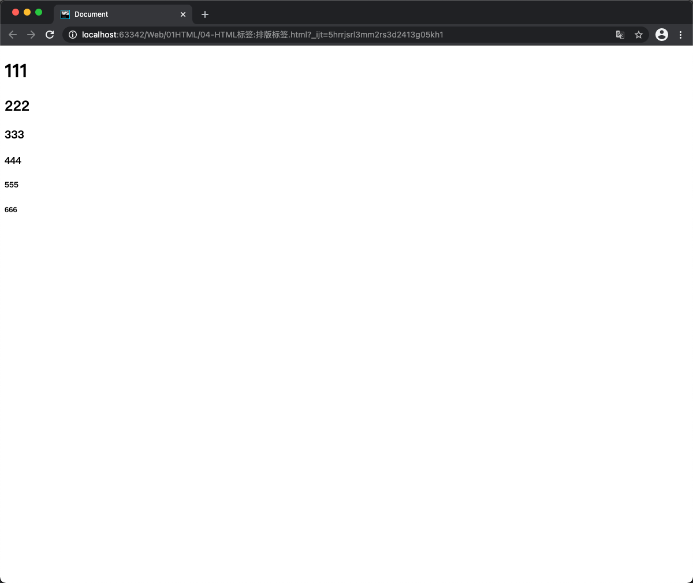
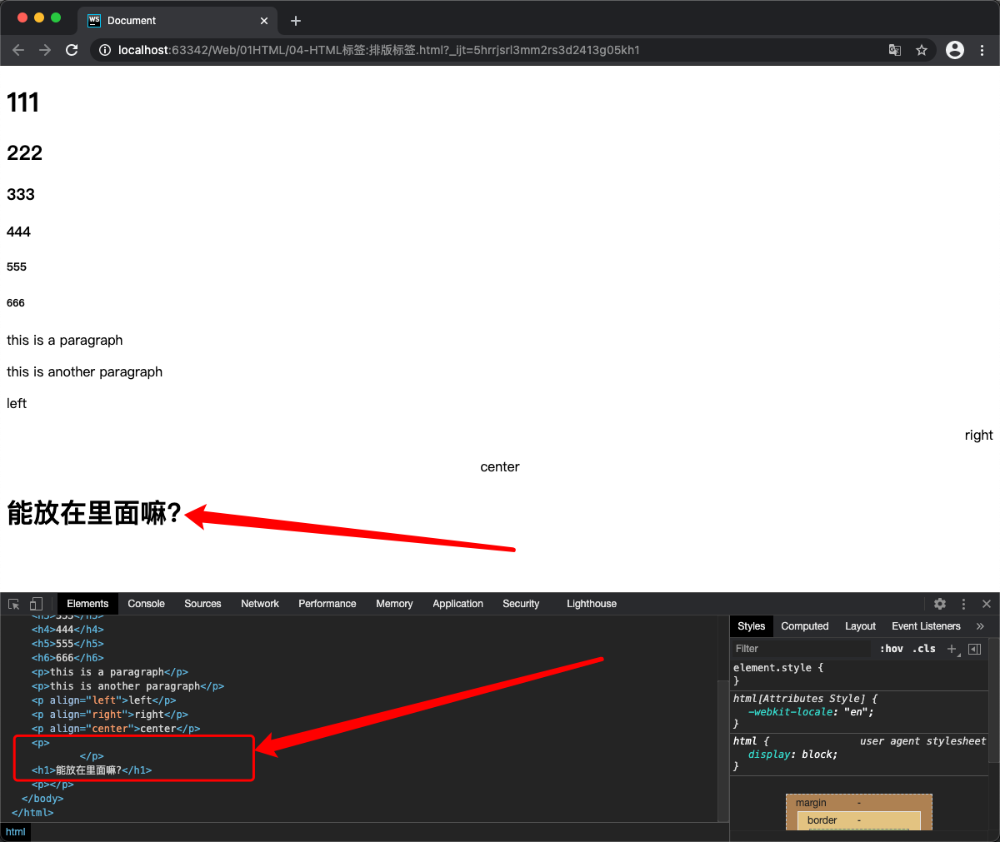
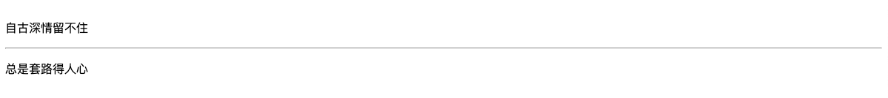
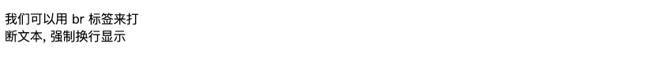
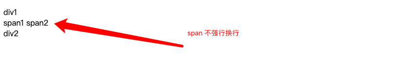
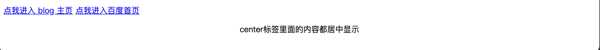

## 本文主要内容

排版标签:

- `<h1>`

- `<p>`

- `<hr />`

- `<br />`

- `<div>`

- `<span>`

- `<center>`

- `<ore>`

下面来详细介绍一下排版标签.

## 标题标签

标题使用 `<h1>` 至 `<h6>` 标签进行定义. `<h1>` 定义最大的标题, `<h6>` 定义最小的标题, 属性值可以是: left、right、center.

代码举例:

```html
<!doctype html>
<html lang="en">
<head>
    <meta charset="UTF-8">
    <meta name="viewport"
          content="width=device-width, user-scalable=no, initial-scale=1.0, maximum-scale=1.0, minimum-scale=1.0">
    <meta http-equiv="X-UA-Compatible" content="ie=edge">
    <title>Document</title>
</head>
<body>
    <h1>111</h1>
    <h2>222</h2>
    <h3>333</h3>
    <h4>444</h4>
    <h5>555</h5>
    <h6>666</h6>
</body>
</html>
```

效果演示:



## HTML 注释的格式如下:

```html
<!-- 我是 HTML 注释 -->
```

## 段落标签 `<p>`

段落, 是英语 "paragraph" 的缩写.

**作用**: 可以把 HTML 文档分割为若干段落. 在网页中如果要把文字有条理的显示出来. 离不开段落标签. 就如同我们平常写文章一样, 整个网页也可以分为若干个段落.

代码举例:

```html
    <p>this is a paragraph</p>
    <p>this is another paragraph</p>
```

属性:

- `align="属性值"`: 对齐方式. 属性值包括left、right、center.

属性举例:

```html
    <p align="left">left</p>
    <p align="right">right</p>
    <p align="center">center</p>
```

HTML 标签是分等级的, HTML将尽所有的标签分为两种:

- **文本级标签**: p、span、a、b、i、u、em. 文本级标签里面只能放 **文字、图片、表单元素** (a 标签里不能放 a 和 input)

- **容器级标签**: div、h系列、li、dt、dd. 容器级别标签里面可以放置任何东西.

从学习 p 的第一天开始, 就要牢牢记住: **p 标签是一个文本级别标签, p 里面只能放文字、图片和表单元素**. 其他的一律不能放.

错误写法: (尝试把 h 放到 p 里)

```html
    <p>
        <h1>能放在里面嘛?</h1>
    </p>
```

网页效果如下:



虽然能正常显示, 但是控制台里面我们发现, 浏览器自己把 p 的闭合标签提前了, 就是为了不让你去包裹 h1.

PS: Chrome 浏览器是 HTML5 支持度最好的浏览器. 提供了非常好的开发工具, 非常适合我们开发人员使用. 审查元素功能的快捷键是 F12.

## 水平线标签 `<hr>`

> horizontal 单词发音: [ˌhɒrɪˈzɒntl]

水平分割线 (horizontal rule) 可以在视觉上将文档分割成各个部分. 在网页中常常看到一些水平线将段落与段落之间隔开, 使得文档结构更加清晰, 层次分明.

代码举例:

```html
    <p>自古深情留不住</p>
    <hr />
    <p>总是套路得人心</p>
```

运行效果:



属性介绍:
- `align="属性值"`: 设定线条放置的位置. 属性可选择: left、right、center.
- `size="2"`: 设定线条粗细. 以像素为单位, 默认为2.
- `width="500"`或`width="70%"`: 设置线条长度. 可以是绝对值 (单位是像素) 或相对值. 如果设置为相对值的话, 默认是100%.
- `color="#000FF"`: 设置线条颜色.
- `noshade`: 不要阴影, 即设定线条为水平显示, 若没有这个属性, 则表明线条具阴影或立体.

```html
    <hr align="center" size="6" width="20%" color="#000FF"/>
```

运行效果:


## 换行标签 `<br />`

如果希望某段文本强制显示换行显示, 就需要使用换行标签.

```html
    <p>我们可以用 br 标签来打<br />断文本, 强制换行显示</p>
```

运行效果:



## `<div>` 和 `<span>` 标签

div 和 span 是非常重要的标签, div 的语义是 division "分割"; span 的语义就是 span "范围、跨度". 想必你应该听说过 "div + css" 布局.

### div 和 span 的介绍

- **div标签**: 可以把标签中的内容分割称为独立的区块. 必须单独占据一行.

- **span标签**: 和 div 的作用一致, 但不换行.

代码举例:

```html
    <div>div1</div>
    <span>span1</span>
    <span>span2</span>
    <div>div2</div>
```

运行效果:



div 标签的属性:

- `align="属性值"`: 设置块儿的位置. 属性值可选择: left、right、center.

### div 和 span 的区别

`<span>` 和 `<div>` 唯一的区别在于: `<span>` 是不换行的, 而 `<div>` 是换行的.

如果单独在网页中插入这两个元素, 不会对页面产生任何影响. 这两个元素是专门为定义 CSS 样式而生的. 或者说, DIV + CSS 来实现各种样式.

div 在浏览器中, 默认是不会增加任何的运行效果的, 但是语义变了, div 重的所有元素是一个小区域.
div 标签是一个**容器**标签, 里面什么都能放. span 里面不能放 p、h、ul、dl、ol、div.

span 举例:

```html
    <p>
        <soan>
            <a href="http://wangyongsi.top">点我进入 blog 主页</a>
            <a href="https://baidu.com">点我进入百度首页</a>
        </soan>
    </p>
```

div 举例:

```html
    <div class="header">
        <div class="log"></div>
        <div class="nav"></div>
    </div>

    <div class="content"></div>
    <div class="footer"></div>
```

我们亲切地称这种模式叫做**DIV + CSS**: **div 标签负责布局、结构、分块儿, css负责样式**

## 内容居中标签 `<center>`

此时 center 代表是一个标签, 而不是一个属性值了. 只要是在这个标签里面的内容, 都会居于浏览器的中间.

center 举例:

```html
    <center>center标签里面的内容都居中显示</center>
```

运行效果:



到了 HTML5 里面, center 标签不建议使用, 建议使用 css 布局来实现.

## 预定义 (预格式化) 标签 `<pre>` 

含义: 将保留标签内部所有的空白字符 (空格、换行符), 原封不动的输出结果 (也就是告诉浏览器不要忽略了空格和换行)

说明: 真正排网页过程中. `<pre>` 标签几乎用不着. 所以此处不做演示.