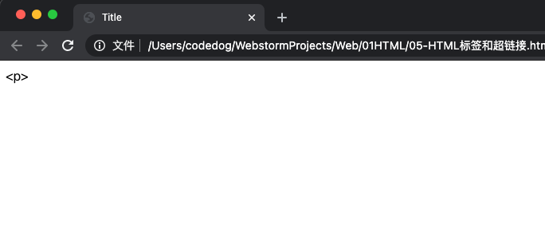
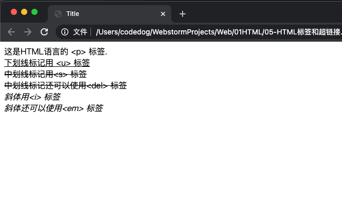
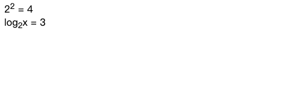

## 本文主要内容

字体标签: `<font>`、`<b>`、`<u>`、`<sup>`、`<sub>`'

超链接 `<a>`

## 字体标签

### 特殊字符 (转义字符)

- `&nbsp;`: 空格 (non-breaking spacing, 不断打空格)
- `&lt;`: 小于号 (less than)
- `&gt;`: 大雨号 (greater than)
- `&amp;`: 符号 `&`
- `&quot`: 双引号
- `&apos`: 单引号
- `&copy`: 版权 `©`
- `&trade`: 商标 `™`
- `&#32464`: 文字 `绐`. 其实, 是汉字 '绐' 的 Unicode 编码.


比如说, 你想把 `<p>` 作为一个文本在页面上显示, 直接写 `<p>` 是肯定不行的, 因为这代表的是一个段落标签, 所以这里需要用到**转义字符**. 应该这么写:

```html
    这是HTML语言的 &lt;p&gt; 标签.
```

正确的效果如下:



其实我们只要记住前三个符号就行了, 其他的需要的时候查一下就行了. 而且, EditPlus 软件中是可以直接点击这些符号进行选择的.

来一张表哥, 方便需要的时候查询:

| 特殊字符 | 描述 | 字符的代码 |
| :--- | :--- | :--- |
| |空格符|`&nbsp;`|
|<|小于号|`&lt;`|
|> | 大于号 |`&gt;`|
|&|和号|`&amp;`|
|￥|人民币|`&yen;`|
|©|版权|`&copy;`|
|®|注册商标|`&reg;`|
|°|摄氏度|`&deg;`|
|±|正负号|`&plusmn;`|
|×|乘号|`&times;`|
|÷|除号|`&divide;`|
|²|平方2（上标2）|`&sup2;`|
|³|立方3（上标3）|`&sup3;`|

### 下划线、中划线、斜体

- `<u>` : 下划线标记.

- `<s>` 或 `<del>` : 中划线标记 (删除线)

- `<i>` 或 `<em>` : 斜体标记

演示代码:

```html

    这是HTML语言的 &lt;p&gt; 标签.

    <br />

    <u>下划线标记用 &lt;u&gt; 标签</u>

    <br />

    <s>中划线标记用&lt;s&gt; 标签</s>

    <br />

    <del>中划线标记还可以使用&lt;del&gt; 标签</del>

    <br />

    <i>斜体用&lt;i&gt; 标签</i>

    <br />

    <em>斜体还可以使用&lt;em&gt; 标签</em>
```

效果如下:



### 粗体标签 `<b>` 或 `<strong>` (已废弃)
### 字体标签 `<font>` (已废弃)

### 上标 `<sup>`、下标 `<sub>`

```html

    2<sup>2</sup> = 4

    <br />

    log<sub>2</sub>x = 3
```

效果如下:



## 三、超链接

超链接有三种形式, 下面分别讲讲

### 1、外部链接: 链接到外部文件

举例:

```html
<a href="02页面.html">点我进入另一个页面</a>
```

a 是英语 `anchor` "锚" 的意思, 就好像这个页面往另一个页面扔出一个锚. 是一个文本级标签。

href (hypertext reference): 超文本地址. 读作 "和瑞夫", 不要读作 "喝夫".

效果如下:


### 2、锚链接

**锚链接**: 给超链接起一个名字, 作用是 **在本页面或者其他页面的不同位置进行跳转**. 比如说, 在页面底部有一个向上的箭头, 点击箭头返回顶部, 这个就可以利用锚链接.

首先我们要创建一个**锚点**, 也就是说, 使用 `name` 属性或者 `id` 属性给那个特定的位置起一个名字. 演示如下:

```html
    <a href="" name="top">顶部</a>
```

上图代码解释:

这行代码表示, 顶部这个锚的名字叫做 `top`.
然后在底部设置超链接, 点击时将返回到顶部 (此时, 网页中的 url 的末尾也出现了 `#top`). 注意不要忘了 `#` 号, 表示跳到名为 top 的特定位置, 这是规定. 如果少了 `#` 号, 点击之后就会跳到 top 这个文件或者 top 这个文件夹中去.

如果我们将上面的代码改成:

```html
<a href="a.html#top">回到顶部</a>
```

那就表示, 点击之后, 跳转到 `a.html` 页面的 `top` 锚点中去.

说明: name 属性是 HTML4.0 以前使用的, id 属性是 HTML4.0 后才开始使用的. 为了向前兼容, 因此, name 和 id 这两个属性都要写上, 并且值是一样的.

### 3、邮件链接

```html
    <a href="mailto:codeDog999@gmail.com">点我给作者发送邮件</a>
```

效果: 点击之后, 就会弹出你电脑上的邮件软件, 作用不大.

### 超链接的属性

- `href`: 目标 URL
- `title`: 悬停文本
- `name`: 用于设置一个锚点名称
- `target`: 告诉浏览器用什么方式来打开目标页面. `target` 属性有以下几个值:
    - `_self`: 在同一个网页中显示 (默认值)
    - `_blank`:  **在新的窗口中打开**
    - `_parent`: 在父窗口中显示
    - '_top': 在顶级窗口中显示
    
`title` 属性举例:

```html
<a href="http://wangyongsi.top" title="来我博客看看?">点击进入我的博客</a>
```

效果如下:


`target` 属性
这个属性, 西方国家, 普遍在本页面跳转, 因为在新页面打开超链接的话, 多了就会出现很多个页面, 相信大家也能体会到, 浏览器用了没一会, 状态栏就装不下了, 所以仁者见仁吧, 视具体情况选择哪个值.

#### 备注1: 分清楚 img 和 a 标签的各自的属性 

区别如下:

```html
    
    <a href=""></a>
```

#### 备注2: a 是一个文本级的标签

比如一个段落里面的内容, 想要所有文字都能被点击, 那么应该 p 包裹 a:

```html
<p>
    <a href="">段落段落段落段落段落段落</a>
</p>
```

而不是 a 包裹 p:

```html
<a href="">
    <p>段落段落段落段落段落段落</p>
</a>
```

a 的语义要小于 p, a 就是可以当作文本来处理, 所以 p里面相当于放的是纯文字.