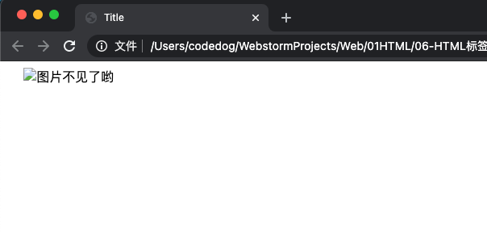
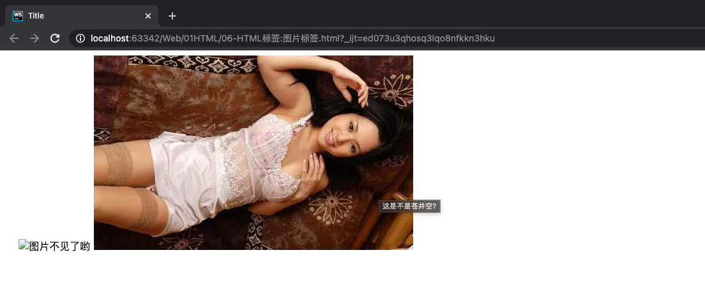

## img 标签介绍

### 介绍

img: 英文全称 image (图像), 代表是一张图片.

如果想要在网页中显示图像, 就可以使用 img 标签, 它是一个单标签. 语法如下:

```html
    
```

### 能插入的图片类型

-  能够插入的图片类型是: jpg (jpeg)、gif、png、bmp 等.

- 不能往网页中插入的图片格式是: psd、ai 等.

HTML 页面不是直接插入图片. 而是插入图片的引用地址, 所以要先把图片上传到服务器上.

## img 标签的 `src` 属性

这里涉及到图片的一个属性:

- `src` 属性: 指图片的路径. 英文名称: source.

在写**图片的路径**时, 有两种写法: 相对路径、绝对路径

### 写法一: 图片的相对路径

相当于当前页面的路径. 两个标记 `.` 和 `..` 分别代表当前目录和上一层目录.

举例1:

```html
    <!--当前目录图片-->
    

    

    <!--上一级目录中的图片-->
    
```

相对路径的面试题, 现有如下文件层级:


问题: 如果想在 index.html 中插入 1.png, 那么对应的 img 语句是?

答案: ``

### 写法二: 图片的绝对路径

绝对路径包括以下两种:

（1）以盘符开始的绝对路径. 举例:

```html

```

（2）网络路径. 举例:

```html

```

大家打开上面的 img 中的链接, 可能有惊喜哦.

## 相对路径和绝对路径的总结

相对路径的好处: 站点不管拷贝到哪里, 文件和图片的相对路径关系都是不变的. 相对路径的使用又一个前提, 就是网页和你的图片, 必须在同一个服务器上.

问题: 我的网页在 C 盘, 图片却在 D 盘, 能不能插入呢?

答案: 用相对路径不能，用绝对路径也不能.

注意: 可以使用 file:// 来插入, 但是这种该方法, 没有任何意义, 服务器上没有所谓的 C 盘, D 盘. （也就是说 Linux 上没有盘符的概念）

**总结以下**

无论是 a 标签还是 img 标签上, 如果要用路径. 只有两种路径能用, 就是i相对路径和绝对路径:

- 相对路径从自己出发, 找到别人.

- 绝对路径 就是 `http://` 或者 `https://` 开头的路径.

- 绝对不允许使用 `file://` 开头的文件, 这个是完全错误的!

## img 标签的其他属性

### width、height 属性

- `width`: 图像的宽度.
- `height`: 图像的高度.

width 和 height , 在 HTML5 中的单位是 CSS 像素, 在 HTML4 中既可以是像素, 也可以是百分比. 可以指定 width 和 height 中的一个值, 浏览器会根据原始图像进行缩放.

**重要提示**: 如果想保证图片等比例缩放, 请只设置 width 和 height 中其中一个.

### alt 属性

- `alt`: 当图片不可用 (无法显示图片、撕裂图片) 的时候, 代替图片显示的内容. alt 是英语 alternate "替代" 的意思, 代表替换资源.

`alt` 属性代码演示:

```html
    
```

效果如下:



如上图所示: 当图片 src 不可用时, 显示文字. 这样做, 至少能让用户知道, 这个图片大概是什么内容.

### title 属性

- `title`: **提示性文本**. 鼠标悬停时, 出现的文本.

title 属性不该被用作一幅图片在 alt 之外的补充说明信息. 如果一幅图片需要小标题, 使用 figure 或 figcaption 元素.

title 元素的值一般作为提示条 (tooltip) 呈现给用户, 在光标位于图片上停下后显示出来. 尽管这的确能给用户提供更多的信息, 您不该假定用户真的能看到: 用户可能只有键盘或触摸板. 如果要把特别重要的信息提供给用户, 可以选择上面提供的一种方法将其内联显示, 而不是使用 title.

举例:

```html
    
```

效果如下:



### align 属性

- 图片的 `align` 属性: **图片和周围文字的相对位置**. 属性取值可以是: bottom (默认)、center、top、left、right.

如果想实现图文混排的效果, 请使用 align 属性, 取值为 left 或者 right.
